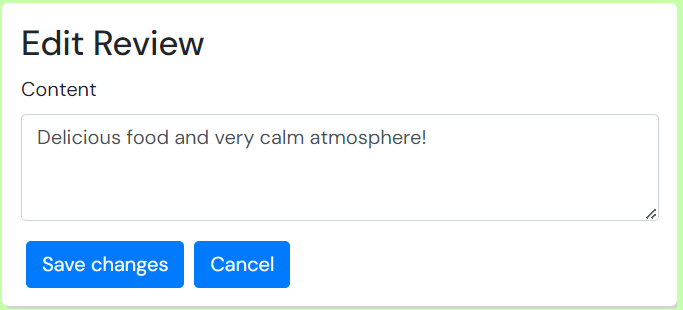

# Features
## Navigation
For the first-time visitor a very basic navigation bar is presented, which sticks at the top of the screen.  

When the user logs in, the navar includes direct links to the most important functionalities of the website without taking up to much real estate.  

For users of mobile devices, the navigation links are hidden behind a burger menu symbol and can be opened by clicking on it.  

  

  

### Register
To register as a new user a basic form is provided, where the user can choose a username, which has to be unique, and can set his password which need confirmation.  

### Login
For the login process a basic form is provided, which asks the user to enter his username and password. After successfully logging in, the user gets redirected to the Homepage again.  

### Logout
To log out, a basic link named `Sign out` is provided when the user is logged in. After clicking on it, the user gets signed out and will be redirected to the Homepage.

## Restaurant Lists
### Home
The homepage looks the same for logged in and logged out users. It provides a list of all restaurants sorted by latest creation per default.  
Functionality to search for keywords or filter by preference is also provided, but more to that further down.  

### My Restaurants
The my restaurant page is only visible to logged in users and features all the restaurants the user added himself. The page is especially relevant when more users add restaurants to being able to access the own creations for editing in an easy manner.  
Except for the fact, that the restaurant list is pre-filtered by creator, the functionality and filter/search function is the same as the homepage.

### Endless Scroll
On both the homepage and the my restaurants page an endless scroll feature is implemented, which automatically loads new content when the user reaches the bottom of the page.  

## Filter & Search Functionality
### Search Field
To allow the users to find fitting restaurants as fast and easy as possible a search field is provided. It allows for searching by keyword and takes the Cuisine Type, restaurant name, Country, City and the Dietary Preference of the meals the restaurant offers as possible criteria.

### Filters
To allow for browsing by predefined interests a filter functionality exists that allows the user to filter for certain Cuisine types or Dietary Preferences.

## Add restaurant
When a user is logged in, he can click on the Add restaurant link provided in the navbar and will be directed to a basic form for adding restaurants.

## Restaurant Detail View
When clicking on the `Click here for more information` link on any given restaurant, the restaurant page will be opened which shows all the information and allows for browsing the dishes and reviews.

### Edit & Delete Restaurant
When the logged in user is the creator of a restaurant, he will also be provided with to buttons on the restaurant card, which allow him to edit or delete the restaurant.

### Dishes
#### Not creator of restaurant
For users that aren't the creator of the restaurant, dishes will be shown as cards containing all the information and a picture of the dish.

#### Creator of the restaurant
When the user is the creator of the restaurant he will be presented with the ability to add new dishes.

#### Edit & Delete
Also, the creator is provided with the ability to edit or delete already existing dishes.

  

### Reviews
Also logged in users are provided with the ability to write reviews for any restaurant they like to.

#### Edit & Delete
Also the user can edit or delete his own reviews at will.

