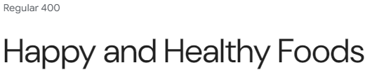
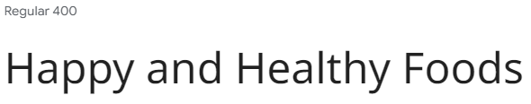
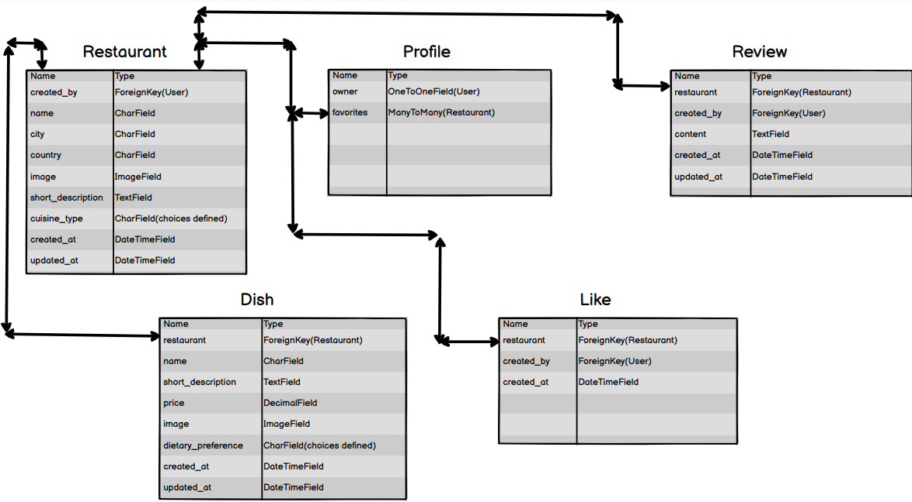

# Happy and Healthy Foods
The restaurant comparison platform **Happy and Healthy Foods** sets out to offer a community-driven approach for comparing restaurants all over the world.  

## User Experience
### The big picture
The theme of the website is to offer every user the ability to add restaurants in an easy and fast way whilst also to be able to browse restaurants others added. Through added filter and search functionalities, users can find their respective city and preferred choice of food in a fast and easy manner. 

### Target Audience
The website is catering towards people who are conscious their food choices and want the ability to predetermine if a given location fits their personal needs.

### User Stories
The following user stories where created to make sure the interests of the target audience are met:

#### **Unregistered User**:
[**User Story:**](https://github.com/MrMarlonM/happy-and-healthy-foods/issues/1) As a first-time visitor I can see an overview of all restaurants so that I can inform myself quickly  
[**User Story:**](https://github.com/MrMarlonM/happy-and-healthy-foods/issues/6) As a first-time user I can register fast and easily so that I can use the advanced functionalities  
[**User Story:**](https://github.com/MrMarlonM/happy-and-healthy-foods/issues/3) As a first-time visitor I can navigate the website easily and intuitively so that I have direct access to all the information provided.  
[**User Story:**](https://github.com/MrMarlonM/happy-and-healthy-foods/issues/4) As a first-time visitor I can open restaurants in a more detailed view so that I can inform me in more detail about the provided options  
[**User Story:**](https://github.com/MrMarlonM/happy-and-healthy-foods/issues/2) As a first-time visitor I can filter the restaurants so that I can search for my preferred regions or food choices  
[**User Story:**](https://github.com/MrMarlonM/happy-and-healthy-foods/issues/14) As a first-time visitor I can filter the dishes of a restaurant so that I can see relevant information more easily  
[**User Story:**](https://github.com/MrMarlonM/happy-and-healthy-foods/issues/5) As a first-time visitor I can see how others rated the restaurant so that I can make up my mind quickly  
#### **Registered User**:
[**User Story:**](https://github.com/MrMarlonM/happy-and-healthy-foods/issues/7) As a registered user I can share my reviews on restaurants so that others can benefit from my experiences  
[**User Story:**](https://github.com/MrMarlonM/happy-and-healthy-foods/issues/9) As a registered user I can add new restaurants so that I can share my experiences and allow others to review the same restaurants  
[**User Story:**](https://github.com/MrMarlonM/happy-and-healthy-foods/issues/13) As a registered user I can add ingredients to dishes so that other users have a clear idea what to food is made of  
[**User Story:**](https://github.com/MrMarlonM/happy-and-healthy-foods/issues/12) As a registered user I can add new cuisine types so that I can customize the restaurants I add  
[**User Story:**](https://github.com/MrMarlonM/happy-and-healthy-foods/issues/11) As a registered user I can change my password so that I can secure my account  
[**User Story:**](https://github.com/MrMarlonM/happy-and-healthy-foods/issues/10) As a registered user I can save restaurants as a favorite so that I can access them quickly and easily.  
[**User Story:**](https://github.com/MrMarlonM/happy-and-healthy-foods/issues/8) As a registered user I can like restaurants so that others can see my appreciation of a certain restaurant  

## Technologies Used
### Languages
- [Python 3.12.2](https://www.python.org/downloads/release/python-3122/): As primary server-side language.
- [JavaScript](https://developer.mozilla.org/en-US/docs/Web/JavaScript): For interactivity on the website.
- [CSS](https://developer.mozilla.org/en-US/docs/Web/CSS): To style the website.
- [HTML](https://developer.mozilla.org/en-US/docs/Web/HTML): The markup language for the website.

### Frameworks and Libraries
- [Django REST API:](https://www.django-rest-framework.org/) For creation of the Backend API
- [React:](https://react.dev/) For creation of the Frontend Application
- [React-Bootstrap:](https://react-bootstrap-v4.netlify.app/getting-started/introduction/) For styling and customization

### Tools and Helpers
- [Pexels](https://www.pexels.com/): For free images.
- [Balsamiq](https://balsamiq.com/): For creation of the Wireframes and Database Models
- [Google Fonts](https://fonts.google.com/): For implementation of different fonts.
- [Heroku](https://www.heroku.com/): To host the live version
- [Github](https://github.com/): To host the code base
- [Git](https://git-scm.com/): For version control
- [VS Code](https://code.visualstudio.com/): As Code Editor
- [Gitpod](https://www.gitpod.io/): As Virtual Development Environment
- [Pip3](https://pypi.org/project/pip/): As package manager for dependencies.
- [Chrome Dev Tools](https://developer.chrome.com/docs/devtools/open/): For debugging the Website.

### Database
- [PostgreSQL from Code Institute](https://dbs.ci-dbs.net/): As cloud database to store the data.

### Python packages
- asgiref==3.8.1
- cloudinary==1.41.0
- dj-database-url==0.5.0
- dj-rest-auth==2.1.9
- Django==4.2.16
- django-allauth==0.53.0
- django-cloudinary-storage==0.3.0
- django-cors-headers==4.4.0
- django-filter==24.3
- django-rest-auth==0.9.5
- djangorestframework==3.15.2
- djangorestframework-simplejwt==5.3.1
- gunicorn==23.0.0
- oauthlib==3.2.2
- pillow==10.4.0
- psycopg2==2.9.9
- PyJWT==2.9.0
- python3-openid==3.2.0
- requests-oauthlib==2.0.0
- setuptools==75.1.0
- sqlparse==0.5.1
- whitenoise==6.4.0

## Features
For an overview of the implemented features, please refer to the [FEATURES.md](/FEATURES.md).

## Future Development
Given the time constraints of the first iteration, some features mentioned in the User Stories weren't implemented and will be left for the next iterations to come. But all features that where listed as must-have and should-have where added.
Here is a short overview of the won't-have User Stories:
- [**User Story:**](https://github.com/MrMarlonM/happy-and-healthy-foods/issues/14) As a first-time visitor I can filter the dishes of a restaurant so that I can see relevant information more easily  
- [**User Story:**](https://github.com/MrMarlonM/happy-and-healthy-foods/issues/13) As a registered user I can add ingredients to dishes so that other users have a clear idea what to food is made of  
- [**User Story:**](https://github.com/MrMarlonM/happy-and-healthy-foods/issues/12) As a registered user I can add new cuisine types so that I can customize the restaurants I add  
- [**User Story:**](https://github.com/MrMarlonM/happy-and-healthy-foods/issues/11) As a registered user I can change my password so that I can secure my account  
- [**User Story:**](https://github.com/MrMarlonM/happy-and-healthy-foods/issues/10) As a registered user I can save restaurants as a favorite so that I can access them quickly and easily.  
- [**User Story:**](https://github.com/MrMarlonM/happy-and-healthy-foods/issues/8) As a registered user I can like restaurants so that others can see my appreciation of a certain restaurant  
- [**User Story:**](https://github.com/MrMarlonM/happy-and-healthy-foods/issues/5) As a first-time visitor I can see how others rated the restaurant so that I can make up my mind quickly  

## Design
The design goal of the website is to present the content in a clear and easy to navigate manner. For that everything is spaced out and all functionalities are directly visible, making it easy for the users to navigate the page very fast.

### Color Scheme
To give the website a fresh and clean look, a light-green together with white was used for all colored parts. For the want a standard black was used to allow for maximal contrast and readability.

### Typography
For the content the font DM-Sans was used and for the Navigation bar the noto-sans font, which is a bit more spacious and gives a bit contrast to the more narrow dm-sans font.  
DM-sans:  
  
Noto Sans:    

### Wireframes
For the Wireframes drawn for this project please refer to [this PDF](documentation/wireframes-website.pdf).

## Agile Methodology
This project embraced Agile principles throughout its development, ensuring flexibility, adaptability, and a user-centric focus. Here's a breakdown of the Agile practices employed:
- **User Stories and Acceptance Criteria:** User stories were used to capture functional requirements from the user's perspective. Each story included clear acceptance criteria to define the conditions for completion.

- **Task Breakdown:** User stories were further broken down into actionable tasks, providing a granular view of the work involved.

- **Product Backlog Prioritization:** User stories were prioritized in the product backlog based on their importance and value to the project, ensuring that the most crucial features were addressed first.

- **Iteration Planning with MoSCoW:** Two iterations (sprints) were planned, with user stories selected based on priority and team capacity. The MoSCoW method (Must-have, Should-have, Could-have, Won't-have) was used to prioritize stories within each sprint.

- **GitHub Projects Kanban Board:** A Kanban board was created in GitHub Projects to visualize and manage the workflow. Columns included "Bug," "To Do," "In Progress," "Done," and "Future Development," allowing for clear progress tracking.

- **Continuous Refinement:** The backlog was continuously refined throughout the project, with user stories being added, modified, or re-prioritized based on feedback and evolving needs.

This Agile approach allowed for flexibility, frequent feedback, and iterative development, ensuring the final product delivered maximum value to users.

## Entity Relationship Model
The following entity relationship model was crafted for the project:  
  

### Dish Model (unique)
Represents a dish served at a restaurant, including its name, description,
    price, image, dietary preferences, and creation/update timestamps.

    Relationships:
    - `restaurant`: The restaurant where the dish is served
                    (ForeignKey to Restaurant).

### Like Model
Represents a 'like' action by a user on a restaurant.

    Relationships:
    - `restaurant`: The restaurant that received the like
                    (ForeignKey to Restaurant).
    - `created_by`: The user who liked the restaurant (ForeignKey to User).

### Profile Model
Represents a user's profile, storing additional information and
    preferences.

    Relationships:
    - `owner`: The user associated with this profile (OneToOneField to User).
    - `favorites`: Restaurants that the user has favorited
                   (ManyToManyField to Restaurant).

### Restaurant Model (unique)
Represents a restaurant, storing its name, location, cuisine type,
    a short description, image, and creation/update timestamps.

    Relationships:
    - `created_by`: The user who created this restaurant
                    (ForeignKey to User).
    - `dishes`: Dishes served at this restaurant
                (reverse relationship from the Dish model).

    - `likes`: Users who have liked/favorited this restaurant
               (reverse relationship from the Like model).

    - `reviews`: Reviews associated with this restaurant
                 (reverse relationship from the Review model).

### Review Model
Represents a review written by a user about a restaurant.

    Relationships:
    - `restaurant`: The restaurant being reviewed (ForeignKey to Restaurant).
    - `created_by`: The user who wrote the review (ForeignKey to User).
  
## Solved Bugs
### Backend
- *Bug 1:*  
  •	Automated tests for adding and removing favorites in a Django REST API were failing.
  •	The `add_favorite` test resulted in a `404 Not Found` error, indicating the `PUT` request wasn't reaching the intended view.
  •	The `remove_favorite` test resulted in a `405 Method Not Allowed` error, suggesting the `DELETE` request wasn't being handled correctly.  
  *Solution:*  
  •	URL configuration: The URL pattern in `urls.py` was adjusted to include `/favorites/` at the end to explicitly define the favorites endpoint.  
  •	View logic:  
    o	The `ProfileDetail` view was enhanced to utilize `RetrieveUpdateDestroyAPIView`, inherently supporting `DELETE` requests.  
    o	The `update` method was adjusted to exclusively handle `PUT` requests for adding favorites and return the expected `'message'` in the response.  
    o	A separate `delete` method was introduced to handle `DELETE` requests for removing favorites.  
  These changes ensured that the tests correctly targeted the favorites endpoint and the view handled both `PUT` and `DELETE` requests as intended, resulting in successful test execution.  

- *Bug 2:*  
  •	A warning message `"min_value should be a Decimal instance"` was appearing during test execution due to an integer being used as the `min_value` for a DecimalField.  
  *Solution:*  
  •	The `MinValueValidator` in the Dish model's price field was updated to use `Decimal('0')`, ensuring type consistency and accurate handling of decimal values.

- *Bug 3:*  
  •	Automated tests for retrieving, updating, and deleting dishes were failing with `404 Not Found` errors, indicating that the dish resources were not being found.  
  *Solution:*  
  •	The URL pattern in `urls.py` for the `DishDetail` view was missing a trailing slash. Adding the trailing slash to the URL pattern `(/dishes/<int:pk>/)` resolved the issue, ensuring that the requests correctly matched the intended view and the dish resources were found successfully.

### Frontend
- *Bug 1:*  
  • After implementing user registration, login, and logout functionality, an unexpected login prompt appears upon page refresh after logging out. The issue persists despite not having any explicit code to trigger such alerts.
  *Solution:*  
  The root cause was the use of `BasicAuthentication` in the Django backend during development, which prompted for credentials when the frontend attempted to access the user endpoint. The solution involved:  
    • Switching to `JWTCookieAuthentication`: Removing the DEV environment variable in the Django settings enabled `JWTCookieAuthentication`, which is more suitable for handling authentication in a React app.  
    •	Adjusting `ALLOWED_HOSTS`: Adding `'127.0.0.1'` to the `ALLOWED_HOSTS` in Django settings resolved a `400 error` caused by the React app running on a different host.
    •	Updating React Scripts: The initial React app setup used an older version of `react-scripts`, causing compatibility issues. Upgrading to the latest version resolved this.

- *Bug 2:*  
  •	When attempting to fetch restaurant details using `axiosReq.get('/restaurants/${id}')`, a `404 error` occurred, indicating the requested URL was not found. The actual URL being sent to the server was incorrect, appending the endpoint to the current page's URL instead of the API's base URL.  
  *Solution:*  
  •	The issue was caused by the missing leading slash in the API endpoint path. By changing the request to `axiosReq.get(/restaurants/${id}/')`, the request is correctly sent to the root of the API, resolving the `404 error` and allowing the restaurant details to be fetched successfully.

- *Bug 3:*  
  •	The `AddDish` component caused an infinite loop and endless loading because it was rendering itself recursively.  
  *Solution:*  
  •	The recursive rendering was eliminated by removing the line `<AddDish />` from within the AddDish component's JSX. This ensures that the component is only rendered once when called from a parent component, preventing the infinite loop.

- *Bug 4:*  
  • The filtering functionality in the RestaurantList component was not working as expected on the `/myrestaurants` page. Even though the correct filter parameter `(created_by__username)` was being passed from `App.js`, the API request was still returning all restaurants instead of just those created by the logged-in user.  
  *Solution:*  
  • The issue was in how the filter prop was being appended to the `URLSearchParams` object in the `RestaurantList` component. It was being appended under the key `created_by` instead of the expected `created_by__username`. The solution involved modifying the `RestaurantList` function to correctly extract the username from the filter prop and append it to the params object under the `created_by__username` key. This ensured that the API request included the correct filter parameter, resulting in the desired filtered list of restaurants on the `/myrestaurants` page.

- *Bug 5:*  
  • When editing a restaurant without changing the image, the form submission would fail with a `400 Bad Request` error, even though the `imageChanged` state was correctly indicating no image change.  
  *Solution:*  
  • The issue was caused by the image field in the Django Restaurant model not being marked as `blank=True`. This made the image field mandatory, even for updates, leading to the backend rejecting requests where the image wasn't provided. The solution involved adding `blank=True` to the image field definition in the model, making it optional during updates.

- *Bug 6:*  
  • API requests in the frontend were failing with `404 (Not Found)` or `405 (Method Not Allowed)` errors because some URLs were missing a trailing slash (/). This caused the requests to be sent to incorrect endpoints on the backend, resulting in unexpected behavior.  
  *Solution:*  
  • The issue was resolved by carefully reviewing the frontend code and adding the missing trailing slashes to the API endpoint URLs. This ensured that the requests were directed to the correct endpoints on the backend, allowing the application to function as intended.

## Unsolved Bugs
No unresolved bugs remain at this time.

## Deployment
### Local Deployment
### Local Deployment
- Open your IDE
- Run the following command in your terminal:
    - `git clone https://github.com/MrMarlonM/happy-and-healthy-foods.git`
- If you are not in the cloned directory, run the following command next:
    - `cd happy-and-healthy-foods`
- Install the dependencies with the following command in your terminal:
    - `pip3 install -r requirements.txt`
- Creat a `env.py` file and add the following variables to it:
    - `import os`
    - `os.environ['SECRET_KEY'] = 'Your secret key'`
    - `os.environ['ALLOWED_HOST'] = '<Your local host URL>'`
    - `os.environ['CLIENT_ORIGIN'] = 'https://<Your local host URL>'`
    - `os.environ['CLOUD_NAME'] = 'Your cloudinary Cloudname'`
    - `os.environ['API_KEY'] = 'Your cloudinary API Key'`
    - `os.environ['API_SECRET'] = 'Your cloudinary API secret'`
    - `os.environ['DATABASE_URL'] = 'Your database URL'`
- Migrate the models to your database through running the following commands in the terminal:
    - `python3 manage.py makemigrations`
    - `python3 manage.py migrate`
- Change the directory now into the frontend folder with the following command:
    - `cd frontend`
- Install the needed packages with the node package manager:
    - `npm install`
- Go back to the root directory of the newly installed app with the following command:
    - `cd ../`
- Now you can run the local version of the project through the following command:
    - `python manage.py runserver`

### Deployment to Heroku
To deploy the application to heroku follow along this steps:
  - Make sure you are in the root directory of the project `happy-and-healthy-foods`
  - Create a new directory for static files
    - `mkdir staticfiles`
  - Now collect the static files for the backend with the following command:
    - `python3 manage.py collectstatic`
  - Change now to the frontend with the following command:
    - `cd frontend`
  - Compile the react files and move them to the staticfiles folder:
    - `npm run build && mv build ../staticfiles/.`
  - Now, push the code from your locally deployed version to Github
    - `git add .`
    - `git commit -m "Your commit message"`
    - `git push`
  - Next, go to [heroku](www.heroku.com) and log into your existing account or create a new one
  - Click on create new app and enter your location and unique app name
  - Click on the settings tab in your app
  - Now add all the variables you set in the env.py file to the Config Vars.
  - Add the following extra variable to the config vars:
    - `COLLECT_STATIC = 1`
  - Still in the settings section click on add Buildpack and make sure to add the following:
    - `heroku/Python`
  - Click on the `Deploy` button in your application
    - Choose Github as deployment method
    - Connect your Github account
    - Connect the repository you pushed to code to
    - Go to manual deploy and choose the correct branch and click on `Deploy Branch`

## References and Credits
As a starting point for the development of this project the [Moments walkthrough project](https://github.com/MrMarlonM/moments) provided by [Code Institute](https://codeinstitute.net/se/) was a great help.  
For the the set up of axiosDefaults.js, the useClickOutsideToggle.js, the useRedirect.js and the utils.js code I relied heavily on the code provided in the [Moments walkthrough project](https://github.com/MrMarlonM/moments).

## Acknowledgments
- I want to thank [Iuliia Konovalova](https://github.com/IuliiaKonovalova) for her guidance and support throughout this project.
- A big thank you to all of the Team of [Code Institute](https://codeinstitute.net/) for providing the learning content which enabled me to create this project.