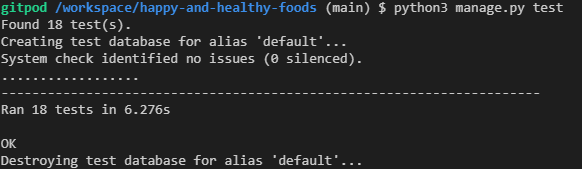
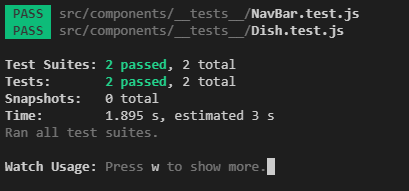
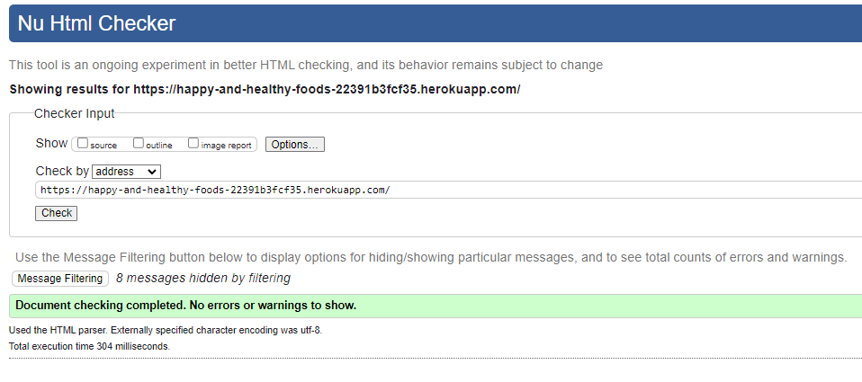
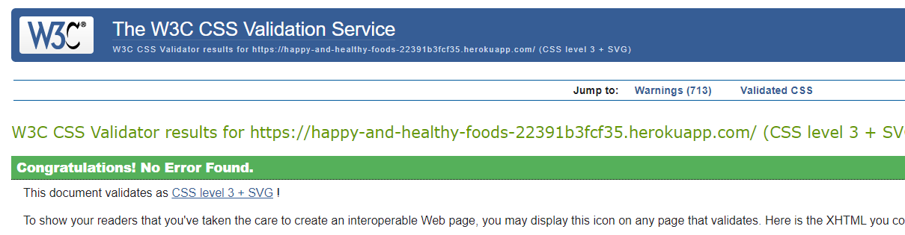
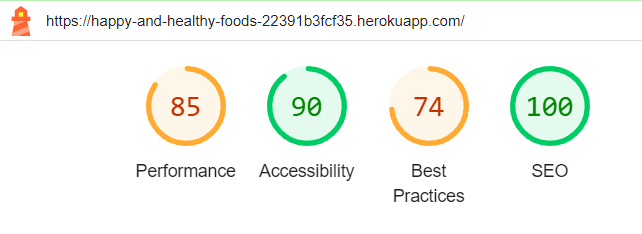

# Testing
## Manual Testing
### User Story: [Overview of restaurants](https://github.com/MrMarlonM/happy-and-healthy-foods/issues/1)
- Acceptance Criteria:
    - All restaurants are listed
    - When scrolling down, new restaurants are loaded
    - Important information is directly visible in the overview
- Manual Steps:
    - Navigate to deployed website `https://happy-and-healthy-foods-22391b3fcf35.herokuapp.com/`
    - Scroll down and look if new restaurants are loaded in the process
    - Look at a random restaurant and check if basic information about the restaurant is provided
- Expected Outcome:
    - When navigating to the website, the user lands on the homepage where a list of all restaurants is presented
    - When scrolling down new restaurants get loaded until all restaurants where presented
    - For each restaurant basic information is present
- Actual Outcome:
    - All expected outcomes where fulfilled

### User Story: [Filter restaurants](https://github.com/MrMarlonM/happy-and-healthy-foods/issues/2)
- Acceptance Criteria:
    - A filter option is provided
    - The option is clearly visible and intuitively to navigate
    - It is at least possible to filter by dietary preference, region, cuisine type
- Manual Steps:
    - Navigate to the homepage through clicking on the `Home` link in the navigation bar at the top of the page.
    - Look that the Search & Filter section is present
    - Click on different filters and combined to see if they get applied
    - Search for specific countries or cities and then apply filters
- Expected Outcome:
    - The Search & Filter section is present
    - When clicking on filters they get applied and the restaurant is reloaded accordingly
    - When combining filters they get applied together
    - When searching for countries/cities the results change accordingly
    - When searching and applying filters together the results change accordingly
- Actual Outcome:
    - All expected outcomes where fulfilled

### User Story: [Easy navigation](https://github.com/MrMarlonM/happy-and-healthy-foods/issues/3)
- Acceptance Criteria:
    - A navigation is clearly visible
    - All options are described and/or labeled where needed
    - For mobile user the navigation is toggable to save real estate
- Manual Steps:
    - Navigate to the deployed version of the website
    - Check if the navigation bar is present
    - Click on Sign up & Sign in to see if the links work
    - Sign in as a user
    - Click on my restaurants and add restaurants and see if the links are working correctly
    - Check on each page if labels are present
    - Go to the deployed website on a mobile phone and check if the navigation links are accessible through toggling the burger menu
- Expected Outcome:
    - The navigation bar is present on desktop devices as well as on mobile devices
    - All information is clearly labeled
    - All links are working
- Actual Outcome:
    - All expected outcomes where fulfilled

### User Story: [Detail view of restaurants](https://github.com/MrMarlonM/happy-and-healthy-foods/issues/4)
- Acceptance Criteria:
    - When clicked on a restaurant in the overview a more detailed view is provided
    - Information about different dishes is visible
    - Reviews from other users are visible
- Manual Steps:
    - Navigate to the homepage
    - Click on the link `Click here for more infos...` on any restaurant
    - See if the restaurant is loaded with all the provided information
    - Scroll down and look if a section Dishes is visible
    - See if a section reviews is visible
- Expected Outcome:
    - When clicking on the link `Click here for more infos...` a new page is opened
    - The restaurant information is loaded correctly and presented in a concise manner
    - A designated section for dishes and reviews is clearly visible
- Actual Outcome:
    - All expected outcomes where fulfilled

### User Story: [Register as a new user](https://github.com/MrMarlonM/happy-and-healthy-foods/issues/6)
- Acceptance Criteria:
    - A register form is provided
    - The registration process is concise and easy to navigate
    - It is clearly stated where to register
- Manual Steps:
    - Make sure to be logged out through clicking on Sign out
    - Click on the Sign up link in the navigation bar
    - Fill in a username and a password
    - Click on register
- Expected Outcome:
    - The Sign up link is clearly visible in the navigation bar
    - The sign up form is labeled so that it is clear where to fill in what
    - When clicking on register the user is redirected to the log in form
    - When putting his credentials in the log in form and submitting the user is logged in successfully
- Actual Outcome:
    - All expected outcomes where fulfilled

### User Story: [Create review for existing restaurant](https://github.com/MrMarlonM/happy-and-healthy-foods/issues/7)
- Acceptance Criteria:
    - When logged in a review form is provided on each restaurant detail page.
    - The reviews are visible to all visitors of the page
    - Users can edit their own reviews
    - Users can delete their own reviews
- Manual Steps:
    - Make sure to log in as a user
    - Navigate to any restaurant page through clicking on the link `Click here for more infos...`
    - Check if the review form is existent
    - Add a new review
    - Check if edit review button is working
    - Check if delete button is working
    - Add a new review
    - Log out
    - Navigate to the same restaurant page
    - Check if the created review is present
- Expected Outcome:
    - When logged in the user can add a review
    - The review is visible to others even when logged out
    - The user can edit and delete his own reviews
- Actual Outcome:
    - All expected outcomes where fulfilled

### User Story: [Add new restaurants](https://github.com/MrMarlonM/happy-and-healthy-foods/issues/9)
- Acceptance Criteria:
    - Logged in users are provided with the ability to add new restaurants
    - It is possible to add dishes to the restaurant
    - It is possible to edit details about the restaurant or the dishes
    - It is possible to delete restaurants oneself created
- Manual Steps:
    - Log in as a user
    - Click on the link `Add restaurant` in the nav bar
    - Fill in all the asked details
    - Click on Add restaurant
    - Be redirected to the Restaurant detail page of the newly added restaurant
    - Check that the Add dishes form is present
    - Fill in all the asked details in the add dish form
    - Click on Add dish
    - Check if the dish is added
    - Click on edit dish and see if the edit dish form is filled in correctly
    - Edit some values and check if the edited values show up correctly
    - Click on delete dish and confirm that the dish is deleted
    - Click on edit restaurant and change some values
    - Check that the edited values are changed correctly after confirming
    - Click on delete restaurant and click on confirm
    - Check after being redirected to the myrestaurants page that the deleted restaurant is gone
- Expected Outcome:
    - When adding a restaurant the restaurant is created and the user is redirected to the restaurant page
    - When adding a dish the dish is created and added to the dishes without refreshing the page
    - A dish can be edited and deleted successfully and the changes take effect without refreshing the page
    - A restaurant can be edited and deleted successfully and the redirections work correctly 
- Actual Outcome:
    - All expected outcomes where fulfilled

## Automated Testing
### Backend
For the backend in sum 18 automated tests where created to make sure all the provided functionality works as intended.  
The tests check if entries for restaurants, reviews and dishes can be created correctly, listed, edited, updated and deleted.

### Frontend
For the frontend two basic automated tests were added to check if the Navbar component and the dish component are rendered correctly.

## Code Validation
### HTML
For the validation of the HTML code the official [W3C Markup Validation Service](https://validator.w3.org/) was used.

### CSS
For the validation of the CSS code of the website [W3C CSS Validation Service](https://jigsaw.w3.org/css-validator/) was used.

### JavaScript
For the validation of the javascript code the [jshint](https://jshint.com/) validator was used.  
Since the validator doesn't know React specific elements, only the code up to the return statement is validated and then a Unclosed Regular Expression warning shows up.  
Please refer to [this pdf](documentation/javascript-validation.pdf) for a detailed documentation.

### Python
For the validation of the python code written for the project the [Code Institute CI Python Linter](https://pep8ci.herokuapp.com/#) was used.  
Please refer to [this pdf](documentation/python-validation.pdf) for a detailed documentation.

### Performance (Google Lighthouse)
To test for the general performance of the website as well as accessability, best practices and SEO, Google Lighthouse was used.  
Here is the score for desktop screens:

Here is the score for mobile devices:

The bad score in the section best practices stems from used third-party-cookies which come from the usage of Cloudinary. In the future a different approach could be used to forgo this.

## Browser Compatibility
The website was tested on the following browsers to ensure cross-browser compatibility and consistent functionality:
- Desktop:
    - Google Chrome
    - Firefox
    - Microsoft Edge
- Mobile:
    - Chrome for Android
    - Safari for OS
    - Opera for Android

The website displayed and functioned correctly across all tested browsers and devices, providing a seamless user experience regardless of the platform.

[Click here](/README.md) to get back to the readme.